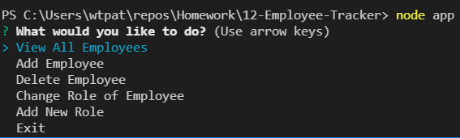

# 12-Employee-Tracker

## Description

This is a command-line application that allows the user to interface with a database with company employees.

## Minimum Viable Product
Feature | Implemented
---|---|
Add departments | No
Add roles | Yes
Add employees Yes
View departments | No
View roles | No
View employees | Yes
Update employee roles | Yes

Bonus features
Feature | Implemented
---|---|
Delete Employees | Yes

The code in this application could be improved quite a bit. It could be shortend a lot, I think. I will have to do that as well as add the MVP features I couldn't implment then resubmit
## Table of Contents

- [Installation](#installation)
- [Usage](#usage)
- [Credits](#credits)
- [License](#license)
## Installation
Clone this project to your PC. Install mysql and Workbench. Use npm i to install dependencies which are inquirer, mysql and console.table
Here is the link to the GitHub repo. The GitHub repo will have a mp4 recording of the app being used.

[https://github.com/minprocess/12-Employee-Tracker](https://github.com/minprocess/12-Employee-Tracker)

The MP4 recording is in the assets folder.
## Usage
First copy the contents of schema.sql into an empty query tab in Workbench and create the employee, role and department tables.
Start the app with the command `node app`.
You will be presented with the following choices

The list below shows the menu of actions that can be taken and for each action what questions or list the user may see.
    View All Employees
    View All Employees by Department
    View All Employees by Manager
    Add Employee
        Employee's first name?
        Employee's last name?
        Choose employee's role from list
        Choose employee's manager from list
    Remove Employee
        Chose employee from list
    Change Role of Employee
        Choose employee with new role from list
        Chose new role of employee from list
    Change Manager of Employee
        Choose employee with new manager from list
        Choose new manager from list
    Add New Role
        What is name of new role?
        What is salary?
        Choose department from list
    Remove Role
        Choose role to be removed from list
    View All Departments
    Add Department
        What is name of new department?
    Remove Department
        Choose department to be removed from list
    Exit

Caution! If Remove Department command is chosen then the employees in that department will be deleted from the table! Similarly removing a role will delete employees having that role from the database.

## Testing and Refactoring
Testing is needed for the following circumstances
1. The first name or last name contain a space such as Jean-Claude van Damme
2. There is an extra space in first name or last name
3. There should be a confirmation before removing an employee, department or role.
4. Two employees with same name

## MIT License

Copyright (c) 2021 William Pate

Permission is hereby granted, free of charge, to any person obtaining a copy
of this software and associated documentation files (the "Software"), to deal
in the Software without restriction, including without limitation the rights
to use, copy, modify, merge, publish, distribute, sublicense, and/or sell
copies of the Software, and to permit persons to whom the Software is
furnished to do so, subject to the following conditions:

The above copyright notice and this permission notice shall be included in all
copies or substantial portions of the Software.

THE SOFTWARE IS PROVIDED "AS IS", WITHOUT WARRANTY OF ANY KIND, EXPRESS OR
IMPLIED, INCLUDING BUT NOT LIMITED TO THE WARRANTIES OF MERCHANTABILITY,
FITNESS FOR A PARTICULAR PURPOSE AND NONINFRINGEMENT. IN NO EVENT SHALL THE
AUTHORS OR COPYRIGHT HOLDERS BE LIABLE FOR ANY CLAIM, DAMAGES OR OTHER
LIABILITY, WHETHER IN AN ACTION OF CONTRACT, TORT OR OTHERWISE, ARISING FROM,
OUT OF OR IN CONNECTION WITH THE SOFTWARE OR THE USE OR OTHER DEALINGS IN THE
SOFTWARE.
