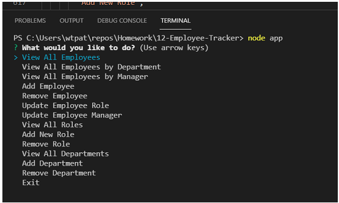

# 12-Employee-Tracker

## Description

This is a command-line application that allows the user to interact with a mySQL database containing three tables of employee information. The database name is employee_db and the three tables are: employee, role and department. The user interacts with the database through inquirer.  

There is a movie in the assets folder that shows all of the available commands be run in inquirer. The link to this movie is  

(https://github.com/minprocess/12-Employee-Tracker/blob/main/assets/Recording_of_Employee_Tracker.mp4)

## Installation
Clone this project to your PC. Use the command `npm i` to install mysql2, inquirer and console.table. schema.sql can be used to seed the database through Workbench.  
Here is the link to the GitHub repo. The GitHub repo will have a mp4 recording of the app being used.  

[https://github.com/minprocess/12-Employee-Tracker](https://github.com/minprocess/12-Employee-Tracker)

The MP4 recording is in the assets folder.
## Usage
First copy the contents of schema.sql into an empty query tab in Workbench and create the employee, role and department tables.
Start the app with the command `node app`.
You will be presented with the following choices 
 

The list below shows the menu of actions that can be taken and for each action what questions or list the user may see.  
&nbsp;&nbsp;&nbsp;&nbsp;View All Employees  
&nbsp;&nbsp;&nbsp;&nbsp;View All Employees by Department  
&nbsp;&nbsp;&nbsp;&nbsp;View All Employees by Manager  
&nbsp;&nbsp;&nbsp;&nbsp;Add Employee  
&nbsp;&nbsp;&nbsp;&nbsp;&nbsp;&nbsp;&nbsp;&nbsp;Employee's first name?  
&nbsp;&nbsp;&nbsp;&nbsp;&nbsp;&nbsp;&nbsp;&nbsp;Employee's last name?  
&nbsp;&nbsp;&nbsp;&nbsp;&nbsp;&nbsp;&nbsp;&nbsp;Choose employee's role from list  
&nbsp;&nbsp;&nbsp;&nbsp;&nbsp;&nbsp;&nbsp;&nbsp;Choose employee's manager from list  
&nbsp;&nbsp;&nbsp;&nbsp;Remove Employee  
&nbsp;&nbsp;&nbsp;&nbsp;&nbsp;&nbsp;&nbsp;&nbsp;Chose employee from list  
&nbsp;&nbsp;&nbsp;&nbsp;Change Role of Employee  
&nbsp;&nbsp;&nbsp;&nbsp;&nbsp;&nbsp;&nbsp;&nbsp;Choose employee with new role from list  
&nbsp;&nbsp;&nbsp;&nbsp;&nbsp;&nbsp;&nbsp;&nbsp;Chose new role of employee from list  
&nbsp;&nbsp;&nbsp;&nbsp;Change Manager of Employee  
&nbsp;&nbsp;&nbsp;&nbsp;&nbsp;&nbsp;&nbsp;&nbsp;Choose employee with new manager from list  
&nbsp;&nbsp;&nbsp;&nbsp;&nbsp;&nbsp;&nbsp;&nbsp;Choose new manager from list  
&nbsp;&nbsp;&nbsp;&nbsp;View All Roles  
&nbsp;&nbsp;&nbsp;&nbsp;Add New Role  
&nbsp;&nbsp;&nbsp;&nbsp;&nbsp;&nbsp;&nbsp;&nbsp;What is name of new role?  
&nbsp;&nbsp;&nbsp;&nbsp;&nbsp;&nbsp;&nbsp;&nbsp;What is salary?  
&nbsp;&nbsp;&nbsp;&nbsp;&nbsp;&nbsp;&nbsp;&nbsp;Choose department from list  
&nbsp;&nbsp;&nbsp;&nbsp;Remove Role  
&nbsp;&nbsp;&nbsp;&nbsp;Choose role to be removed from list  
&nbsp;&nbsp;&nbsp;&nbsp;View All Departments  
&nbsp;&nbsp;&nbsp;&nbsp;Add Department  
&nbsp;&nbsp;&nbsp;&nbsp;&nbsp;&nbsp;&nbsp;&nbsp;What is name of new department?  
&nbsp;&nbsp;&nbsp;&nbsp;Remove Department  
&nbsp;&nbsp;&nbsp;&nbsp;&nbsp;&nbsp;&nbsp;&nbsp;Choose department to be removed from list  
&nbsp;&nbsp;&nbsp;&nbsp;Exit  

Caution! If Remove Department command is chosen then the employees in that department will be deleted from the table! Similarly removing a role will delete employees having that role from the database.

## Testing and Refactoring
Testing is needed for the following circumstances
1. The first name or last name contain a space such as Jean-Claude van Damme
2. There is an extra space in first name or last name
3. There should be a confirmation before removing an employee, department or role.
4. Two employees with same name

## MIT License

Copyright (c) 2021 William Pate

Permission is hereby granted, free of charge, to any person obtaining a copy
of this software and associated documentation files (the "Software"), to deal
in the Software without restriction, including without limitation the rights
to use, copy, modify, merge, publish, distribute, sublicense, and/or sell
copies of the Software, and to permit persons to whom the Software is
furnished to do so, subject to the following conditions:

The above copyright notice and this permission notice shall be included in all
copies or substantial portions of the Software.

THE SOFTWARE IS PROVIDED "AS IS", WITHOUT WARRANTY OF ANY KIND, EXPRESS OR
IMPLIED, INCLUDING BUT NOT LIMITED TO THE WARRANTIES OF MERCHANTABILITY,
FITNESS FOR A PARTICULAR PURPOSE AND NONINFRINGEMENT. IN NO EVENT SHALL THE
AUTHORS OR COPYRIGHT HOLDERS BE LIABLE FOR ANY CLAIM, DAMAGES OR OTHER
LIABILITY, WHETHER IN AN ACTION OF CONTRACT, TORT OR OTHERWISE, ARISING FROM,
OUT OF OR IN CONNECTION WITH THE SOFTWARE OR THE USE OR OTHER DEALINGS IN THE
SOFTWARE.
